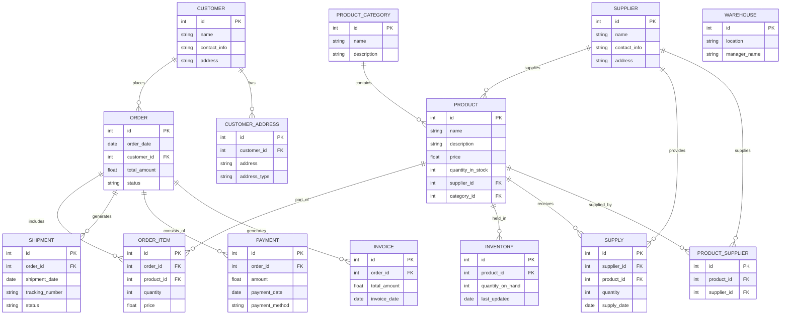

## 1. Database Schema



# Entities
```
CUSTOMER - Information about clients.
SUPPLIER - Data about suppliers.
PRODUCT - Information about products, their prices and quantities in stock.
ORDER - Orders from customers.
ORDER_ITEM - Contents of orders.
INVENTORY - Data on inventory of goods.
WAREHOUSE - Information about warehouses.
SUPPLY - Supplies from suppliers.
SHIPMENT - Data on the delivery of orders.
PAYMENT - Information about payments.
INVOICE - Issued invoices.
CUSTOMER_ADDRESS - Customer addresses.
PRODUCT_CATEGORY - Product categories.
PRODUCT_SUPPLIER - Relationship between products and suppliers.
```